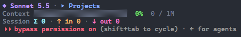

# claude-code-statusline

[](https://github.com/denfry/claude-code-statusline/actions/workflows/test.yml)
[](LICENSE)


A three-row status line for [Claude Code](https://claude.com/claude-code): a context bar with a green→red gradient, session token totals, model, folder and git branch. One Node.js file, no dependencies.



```
◆ Sonnet 5.5 · ▸ my-project · ⎇ main
Context ████████▒▒▒▒▒▒▒▒▒▒▒▒▒▒▒▒  34%  340k / 1M
Session Σ 1.2M · ↑ in 1.1M · ↓ out 90k
```

## Features

- **Context bar** — tokens currently in the window (input + cache creation + cache reads), window size and percent. The bar goes green → yellow → red as it fills.
- **Session totals** — all input and output tokens spent in the session.
- **Model, folder, git branch** — the branch comes from `git`, or from the worktree name if Claude Code provides one.
- **Robust** — missing fields or invalid JSON never crash it; you get `Context —` and zero totals.
- **Fast and tiny** — a single file, no dependencies, one short `git` call.

## Requirements

- Node.js 16+
- A terminal with truecolor (24-bit) support: Windows Terminal, iTerm2, kitty, WezTerm, VS Code and most modern terminals.

## Install

```sh
git clone https://github.com/denfry/claude-code-statusline
cd claude-code-statusline
node install.js
```

`install.js` copies `statusline.js` to `~/.claude/` and sets `statusLine` in `~/.claude/settings.json`. An existing `statusLine` is saved to `settings.json.statusline-backup.json` first. Restart Claude Code afterwards.

<details>
<summary>Manual install</summary>

Copy `statusline.js` anywhere and add to `~/.claude/settings.json`:

```json
"statusLine": { "type": "command", "command": "node \"/path/to/statusline.js\"" }
```

</details>

## Uninstall

```sh
node uninstall.js
```

Restores the previous `statusLine` if there was one, otherwise removes it, and deletes `~/.claude/statusline.js`.

## How it works

Claude Code runs the command from `statusLine` and sends session data as JSON on stdin; whatever is printed to stdout becomes the status line, one row per line. The script reads `model`, `workspace`, `worktree` and `context_window` (`context_window_size`, `used_percentage`, `current_usage`, `total_input_tokens`, `total_output_tokens`) and prints three rows.

## Customize

- Colors: the `C` object and `heat()` near the top of `statusline.js`.
- Bar length: the `n` argument of `bar()` (default 24).
- Rows: built at the bottom of the file; reorder or remove them as you like.

## Test

```sh
npm test
```

## Troubleshooting

| Symptom | Fix |
| --- | --- |
| Nothing shows up | Restart Claude Code; check that `node` is in the `PATH` Claude Code uses and that `statusLine` in `settings.json` points to an existing file. |
| Strange colors | The terminal lacks truecolor support; edit the `rgb()` colors to your taste. |
| Bar is barely visible | Make `track` in `C` lighter. |
| Everything is zero | Normal at the very start of a session; values appear after the first reply. |

## License

[MIT](LICENSE)
